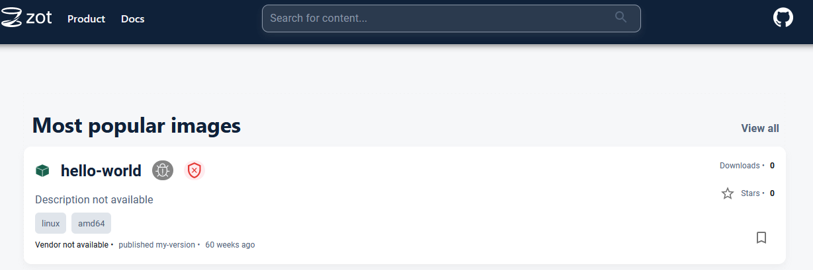
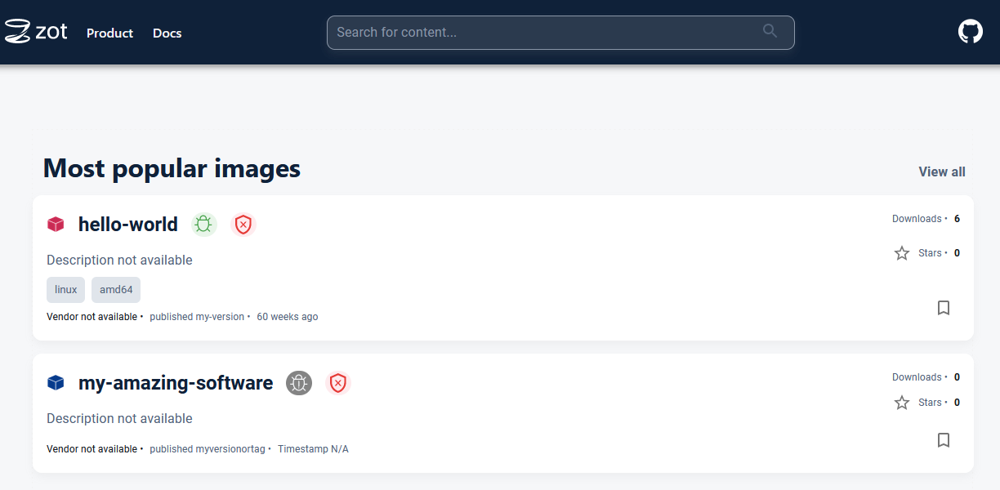
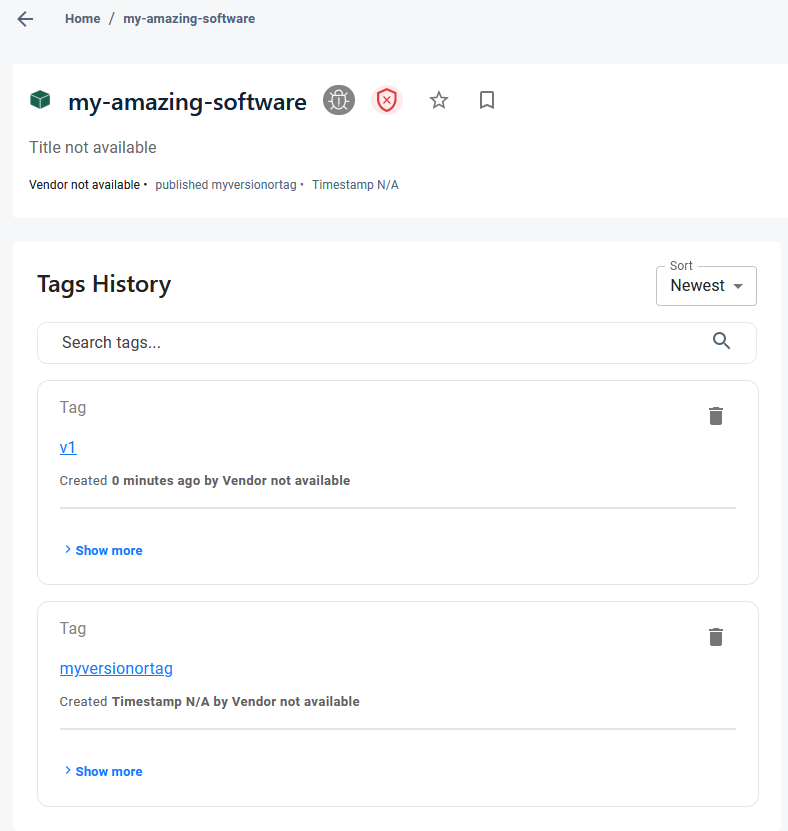

As a Software Engineer, you're undoubtedly familiar with package management tools like npm, Maven, RubyGems, pip, NuGet, Cargo and many more. Additionally, if you're a Support/Operations Engineer (DevOps, SRE, Platform, etc.), you've likely worked extensively with these tools and possibly maintained private servers for them.

With the rise of containerization technologies, and several tools emerging in this area, the community felt the need for standards regarding creating, running and distributing containers.

*Enter the OCI Specification*

# The Evolution of Containerization and the Birth of OCI

Docker was initially released about 11 years ago and is often credited as the primary driver of the virtualization revolution we've experienced over the past decade.

Docker quickly became the most frictionless way of running non-OS-level virtualization. While Docker didn't invent containers, it significantly advanced their development. Containerization began with simple tools like `chroot`, `jail`, and `cgroups`, which were later combined into LXC, creating a powerful virtualization tool that initiated a new way of running software.

Halfway through this revolution (around 2015), Docker and several other companies started working on standards for all of these underlying paradigms. From the way we package containers to the way we run them. The Open Container Initiative was formed and from it the *OCI Specifications* were born.

For a deeper dive into this topic, refer to the referenced articles.

# Open Container Initiative (OCI)

As the story tells us, OCI was born from the need for standards for container technologies. This meant that instead of having a "single" highly opinionated tool to create and run containers there was now a standard that other projects could follow, to implement they're own container tools, and still allow interoperability and reusability to the users of such tools. One example is `runc`, which replaced `libcontainer` as the container runtime for `docker` (later wrapped around in `containerd` which, from v1.22 and on, is the default container engine for Kubernetes). `runc` was launch at the same time as the OCI and was already built around the idea of creating a standard for container runtimes.
# What does OCI Spec has to do with Package Management?

Containers, like any other software, need to be distributed. *OCI*, aiming for standards in creation and runtime, also developed a standard for packaging and distributing container *images*, known as the *OCI Image Format Spec*. Initially focused on container images, this specification led to the development of a broader one: the *OCI Distribution Spec*. This broader spec uses the lessons and techniques developed for container images to facilitate generic content packaging and distribution.

In short, both *OCI Image Format Spec* and *OCI Distribution Spec* define a standard for a package manager that has a set of useful and interesting features like 
- Custom metadata
- Artifact layers (allows for caching and reuse between artifacts)
- Tagging

From here on out, we will refer just to *OCI Spec* whenever we want to talk about either the *Image Format* or the *Distribution* aspects of them. It should be clear to the reader, based on the context, which spec we are referring to.

We are not implying that *OCI Spec* compliant tools are the best package management tools available, or that their features are unique. The main point is that containers, are here to stay and are becoming (if not already) the most common way to package, distribute and run software, regardless of the underlying tech stack. This raises the question, "Why not package everything using these standards?". The answer, of course, is that it depends! 
The fact is, we can use the _OCI Spec_ to package any (terms and conditions may apply :D ) software. Our aim is to provide you with enough information to know: 1) that it is possible and 2) how to do it.

Some of you may already be wondering, or perhaps frantically searching, "Surely a tool already exists for this," and you'd be right. That tool exists, and we'll touch on it later in this article. However, our goal is to equip you with enough knowledge to navigate this largely unexplored world of packaging and distributing generic content using the _OCI Spec_. I the last section we will briefly touch in using brew to install *OCI* compliant packages. This is a trivial example on why it is important to understand the basics of working with this specification.


## What does OCI Spec define?


Among other thing, *OCI Spec* defines, workflows, backwards compatibilities, api etc. We will focus on the Api part of the spec as it is mostly with this Api definition we want the reader to be able to work with. Several other aspects will become clear as we provide examples.

### OCI (Distribution) Spec API

The *OCI Spec* defines an API which is composed by the following first class citizens
- `manifests`: Documents that define the composition and structure of a package. They contain metadata about the package and references to the individual `blobs` that make up the package.
- `blobs`: Binary large objects that serve as the building blocks of a package. Blobs can include filesystems, configuration files, and other binary data necessary to construct the final artifact.
- `tags`: Pointers to the manifests, typically associated with software versions. A manifest can have several tags.
- `referrers`: References to other artifacts, providing a way to associate additional metadata or related content with a specific artifact.st

## *OCI* Package Management -- The Hard Way

### Local Environment Setup

Unfortunately this where irony kicks in. Despite Docker being the parent of the *OCI Spec*, the `docker` CLI and the [docker.io](docker.io) registry use and store images in the docker format, as such for the next steps we will use the `podman` tool that uses *OCI Spec* as it's default operating mode. 

Go to the `podman` [oficial website](https://podman.io/) an follow the instructions to download and install in your operating system.

We're also assuming that you are currently using a Unix-based OS. Although this should work with some changes in Windows.

To experiment with this we recommend using Zot. To run `Zot` locally, for testing purposes, simply run

```shell
podman run -p 5000:5000 ghcr.io/project-zot/zot:latest
```

Now you should be able to access `Zot` landing page on you browser by accessing [http://localhost:5000](http://localhost:5000)

We will use `curl` and `jq` in the next sections so make sure you have them installed.

### Analyzing `hello-world` container image (*OCI Image Format*)

Let's pull one of the smallest images we have and check it out

```bash
podman pull docker.io/hello-world
```

Note that we are still leveraging Docker official registry ([docker.io](docker.io)), but since it is also compliant with *OCI Spec*, `podman` will pull the images in the *OCI Spec* format. Let's push the image to our local *Zot* registry.

```bash
podman tag docker.io/hello-world localhost:5000/hello-world:my-version
podman push --tls-verify=false localhost:5000/hello-world:my-version
```

You should see the image being pushed successfully and you can now find it in our local *Zot* instance.



Now comes the fun part. Let's inspect the image manifest using the *OCI Spec* APIs. In this case we will query the endpoint `/v2/<name>/manifests/<reference>`

```bash
curl -X GET --silent localhost:5000/v2/hello-world/manifests/my-version | jq
```

**Note:** `<name>` parameter may contain `/`. This is part of the spec and allows registries to support folder like structure of artifacts.

You should see an output similar to the following one.

```json
{
  "schemaVersion": 2,
  "mediaType": "application/vnd.oci.image.manifest.v1+json",
  "config": {
    "mediaType": "application/vnd.oci.image.config.v1+json",
    "digest": "sha256:.........",
    "size": 581
  },
  "layers": [
    {
      "mediaType": "application/vnd.oci.image.layer.v1.tar+gzip",
      "digest": "sha256:.......",
      "size": 2501
    }
  ],
  "annotations": {
    "org.opencontainers.image.revision": "XXXXXXXXXXX",
    "org.opencontainers.image.source": "https://github.com/docker-library/hello-world.git#XXXXXXXXXXX:amd64/hello-world",
    "org.opencontainers.image.url": "https://hub.docker.com/_/hello-world",
    "org.opencontainers.image.version": "linux"
  }
}
```

What we see here is:
- **mediaTypes** specify the vendor, in this case *oci*; a name for the type; *manifest*, *config* and *layer* are some examples of type descriptions; and a *version* and file type indicator. (*mediaTypes* follow [rfc6838](https://datatracker.ietf.org/doc/html/rfc6838));
- **config** section defines a *blob* that stores metadata. Tipically for container images this *blob* contains, among other thing, container port information;
- **layers** is a list of *blobs*. These *blobs* are the actual layers of the container in this example.
- **annotations** is additional metadata that you can store with information regarding your *OCI* artifact.

So, what is this all used for? 

Clients like `docker` and `podman`, whenever you pull an images, first start by pulling its manifest, and based on it they are able to pull the container layers (only those that they do not currently have locally stored) and also have details on container ports, entrypoints, commands, etc (available in the config blob). 
Notice that we have not mentioned the 

### Storing any artifact using *OCI Distribution Spec*

So now that we've seen how the *OCI Spec* treats container images we should be ready to handle creating and obtaining our own artifacts using it.

- Create your "software". Lets also entertain the idea of packing it in a *tar.gz* format 
```bash
echo "foo" > bar.txt
tar -czvf my.amazing.software.tar.gz bar.txt
```
- Upload your *blob*
```bash
curl -i -X POST -H "Content-Type: application/octet-stream" \
	localhost:5000/v2/my-amazing-software/blobs/uploads/?digest=sha256:$( sha256sum my.amazing.software.tar.gz | cut -d ' ' -f 1) \
	--data-binary @"my.amazing.software.tar.gz"
```

save the digest information, the `sha256:XXX`, that appears as in the result of the command above
- Upload your config layer
```bash
echo "{}" > config.json
curl -i -X POST -H "Content-Type: application/octet-stream"         localhost:5000/v2/my-amazing-software/blobs/uploads/?digest=sha256:$( sha256sum config.json | cut -d ' ' -f 1)  --data-binary @"config.json"
```
- Get your layers sizes (needed for the manifest)
```bash
curl -i -X GET "localhost:5000/v2/my-amazing-software/blobs/<DIGEST>"
```
get layers sizes for both the artifact *blob*, as well as the config *blob*. If the command fails because you didn't specify the output don't worry. We are mainly interested in the `Content-Lenght` response header from `curl`. This is where you will fetch your sizes 
- Upload your *manifest*
```json
{
  "schemaVersion": 2,
  "mediaType": "application/vnd.my.amazing.software.manifest.v1+json",
  "config": {  
    "mediaType": "application/vnd.oci.empty.v1+json",  
    "digest": "<YOU SHA256 DIGEST>",
    "size": <YOUR CONFIG BLOB SIZE>
  },
  "layers": [
    {
      "mediaType": "application/vnd.my.amazing.software.layer.v1.tar+gzip",
      "digest": "<YOU SHA256 DIGEST>",
      "size": <YOUR BLOB SIZE>
    }
  ],
  "annotations": {
    "my.metadata.label.foo": "bar"
  }
}
```
you can store the manifest in a file or simply pass the *json* directly into curl, like this
```bash
curl -i -X PUT -H "Content-Type: application/vnd.oci.image.manifest.v1+json" localhost:5000/v2/my-amazing-software/manifests/myversionortag --data '{ "schemaVersion": 2, "mediaType": "application/vnd.my.amazing.software.manifest.v1+json", "config": { "mediaType":"application/vnd.my.amazing.software.config.v1+json", "digest": "<YOU SHA256 DIGEST>", "size": <YOUR CONFIG BLOB SIZE> }, "layers": [ { "mediaType": "application/vnd.my.amazing.software.layer.v1.tar+gzip", "digest": "<YOU SHA256 DIGEST>", "size": <YOUR BLOB SIZE> } ], "annotations": { "my.metadata.label.foo": "bar" } }'
```
**Note:** we have used `myversionortag` as the reference for the newly created package. This typically would be the version of your software.

You can check your `zot` ui. It should look something like this.


And there you have it! You just successfully publish your package using *OCI Spec* ... the hard way 🙂

### Fetching an artifact using *OCI Distribution Spec*

Now let's try and fetch back the artifact. 

Remember the process we did to push it?

1. Prepare the artifact
2. Create the *blob* with the artifact
3. Create the *blob* with the config
4. Create the *manifest*

Now you can simply revert these steps. Starting by pulling the artifact manifest for the appropriate version (*reference*) and then pull the configs and/or the layers one-by-one and reassemble your files.
Here's a simple `bash` script to pull the *blobs* from an artifact (assuming our *blobs* are `tar.gz` files)

```bash
#!/bin/bash

REG_URL="https://my-oci-registry.com"
ARTIFACT_NAME="my-awsome-software"
TAG="your_tag"

# Get manifest
curl -X GET "${REG_URL}/v2/${ARTIFACT_NAME}/manifests/${TAG}" -H "Accept: application/vnd.oci.image.manifest.v1+json" -o manifest.json

# Parse manifest to get layer digests
BLOBS=$(jq -r '.layers[].digest' manifest.json)

# Download blobs
for DIGEST in $BLOBS; do
    curl -X GET "${REG_URL}/v2/${ARTIFACT_NAME}/blobs/${DIGEST}" -o "$(basename ${DIGEST}).tar.gz"
done
```

## Integrating/Using Existing tools

There are currently several tools that work with either *OCI Image Format* or the *OCI Distribution Spec*. We well present you one such tool that works with the latter, as well as show you some other use cases of the *OCI Distribution Spec*.

### ORAS

[ORAS](https://oras.land/) is a tool that does all the heavy lifting for your. For example if you want to replicate what we previously did using `oras` you would simply run the following command.
```bash
oras push localhost:5000/my-amazing-software:v1 my.amazing.software.tar.gz:application/vnd.my.amazing.software.layer.v1.tar+gzip
```

In this case we used `v1` as reference. If we go back to the `zot` ui and open our artifact page we can see both the versions that we pushed.



In the same fashion, you could pull artifacts using `oras`.
```bash
oras pull localhost:5000/my-amazing-software:v1
```

### Helm 

Helm is yet another use case that recently (starting in version 3, and generally available in version v3.8.0) started using the *OCI Spec* to store it's artifacts. This brought several advantages, the main ones being, removing the need to manage the single file index for the chart repository servers and being able to store both containers and charts within the same platform.

There is no need to go into much detail since by now we expect the reader to have a basic understanding of the *OCI Spec* so we will just leave you with an example of a manifest pulled from a *OCI* registries pertaining to a `helm` chart.


```json
{
  "schemaVersion": 2,
  "config": {
    "mediaType": "application/vnd.cncf.helm.config.v1+json",
    "digest": "sha256:8ec7c0f2f6860037c19b54c3cfbab48d9b4b21b485a93d87b64690fdb68c2111",
    "size": 117
  },
  "layers": [
    {
      "mediaType": "application/vnd.cncf.helm.chart.content.v1.tar+gzip",
      "digest": "sha256:1b251d38cfe948dfc0a5745b7af5ca574ecb61e52aed10b19039db39af6e1617",
      "size": 2487
    },
    {
      "mediaType": "application/vnd.cncf.helm.chart.provenance.v1.prov",
      "digest": "sha256:3e207b409db364b595ba862cdc12be96dcdad8e36c59a03b7b3b61c946a5741a",
      "size": 643
    }
  ]
}
```

This shows that the `helm` approach is pretty similar to the one we simulated previously.


### *OCI* Artifacts as `brew` packages

So, why should you bother knowing all of those steps to interact with the API if `oras` can simply do it for you? 
Well, one really good use case would be to integrate *OCI* registries with the `brew` tool.

`brew`, at it's core, is a package manager that works based on *formulas* you define, specifying where to fetch the software from and how to install it. In addition to base information like, version, artifact server, os specific rules, *formulas* also allow you to specify a *strategy*.
A *strategy* defines how you should fetch your package from the artifact server. 

You probably see where this is going! With the work we have previously done, we can now define `brew` *formulas* and a *strategy* to be able to leverage *OCI* compliant artifact servers to host your software packages a use `brew` to install those artifacts.
 
## Conclusion

We have seen a bit of the backstory of *OCI*. We have scratched the surface on how to work with *OCI Spec* compliant registries, mainly through the use of it's APIs. And finally we have touched briefly on examples of existing tools that allows us to work with these registries and perharps even integrate them with other existing tools. In summary we have seen the capabilities/features that containers images distribution provides and how we can transport them into other 

## References
- https://www.pluralsight.com/resources/blog/cloud/history-of-container-technology
- https://erzeghi.medium.com/yet-another-brief-history-of-container-d-2962eac9679e
- https://sestegra.medium.com/oci-registry-store-more-than-container-images-08ca1ac74a01
- https://opencontainers.org/
- https://github.com/opencontainers/distribution-spec/
- https://www.docker.com/blog/demystifying-open-container-initiative-oci-specifications/
- https://datatracker.ietf.org/doc/html/rfc6838
